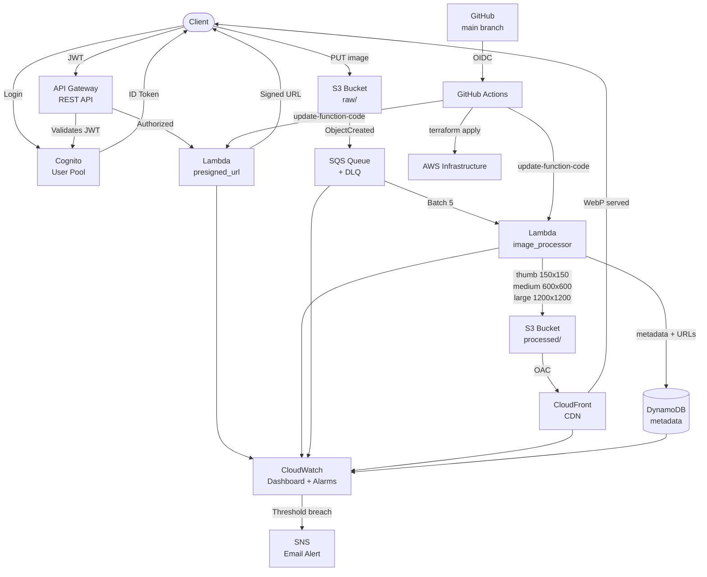

# E-Commerce Image Platform — x100 Scale

Production-grade serverless image processing platform built on AWS. Handles upload, multi-variant processing, CDN delivery, and observability for e-commerce workloads at scale.

---

## Architecture



---

## Stack

| Layer | Service |
|---|---|
| Auth | Amazon Cognito User Pool |
| API | API Gateway REST + Cognito Authorizer |
| Compute | AWS Lambda (Python 3.12) |
| Storage | S3 (raw + processed, separate buckets) |
| Queue | SQS + Dead Letter Queue |
| Database | DynamoDB On-Demand |
| CDN | CloudFront + OAC |
| IaC | Terraform (remote state S3 + DynamoDB locking) |
| CI/CD | GitHub Actions + OIDC (no static credentials) |
| Observability | CloudWatch Dashboard + Alarms + SNS |

---

## Key Design Decisions

**Why two S3 buckets instead of prefixes?**  
Independent lifecycle policies — raw images expire in 30 days, processed images transition to Infrequent Access at 90 days. IAM roles are scoped per bucket: `presigned_url` Lambda has `s3:PutObject` on raw only, `image_processor` has `s3:GetObject` on raw and `s3:PutObject` on processed. A single bucket would require more complex conditions on every policy.

**Why SQS between S3 and Lambda?**  
Direct S3→Lambda triggers lose messages if Lambda fails. SQS adds durability: messages retry up to 3 times (`maxReceiveCount`), then move to the DLQ for inspection. `visibility_timeout` is set to 180s — 6× Lambda's 30s timeout — so SQS doesn't re-enqueue a message that's still being processed.

**Why API Gateway REST over HTTP API?**  
REST API supports Cognito Authorizers natively, usage plans, and request validation — features that demonstrate enterprise-grade patterns. HTTP API is cheaper but lacks these controls.

**Why OIDC for CI/CD instead of access keys?**  
GitHub obtains short-lived tokens from AWS (minutes, not months). No static credentials stored in GitHub Secrets. If the repo is compromised, there are no long-lived keys to extract.

**Why CloudFront OAC over OAI?**  
OAC uses SigV4 request signing and is AWS's current recommendation. OAI relies on a legacy IAM principal type that AWS is phasing out.

---

## Upload Flow

```
1. Client authenticates → Cognito returns ID Token (JWT)
2. Client sends POST /upload with JWT in Authorization header
3. API Gateway validates JWT against Cognito — 401 if invalid
4. Lambda generates presigned S3 URL (5 min TTL, signed ContentType)
5. Client uploads directly to S3 raw/ using presigned URL
6. S3 fires ObjectCreated event → SQS queue
7. Lambda image_processor picks up batch (up to 5 messages)
8. Generates thumb/medium/large WebP variants via Pillow (Klayers)
9. Uploads variants to S3 processed/ with CacheControl: max-age=31536000
10. Writes metadata + CloudFront URLs to DynamoDB
11. Client fetches images via CloudFront — S3 direct access returns 403
```

---

## Observability

| Alarm | Threshold | Meaning |
|---|---|---|
| SQS backlog | > 100 messages | Lambda not keeping up with upload rate |
| Lambda errors | > 5 in 5 min | Systematic processing failure |
| CloudFront cache hit | < 80% | Cache misconfiguration or cache busting |

Dashboard widgets: SQS depth, Lambda error rate, CloudFront cache hit ratio, DynamoDB write capacity.

---

## Deploy

### Prerequisites
- AWS CLI configured
- Terraform ≥ 1.7
- GitHub repo with `AWS_ACCOUNT_ID` secret

### Bootstrap (one-time)
```bash
cd terraform/bootstrap
terraform init
terraform apply
```

### Deploy infrastructure
```bash
cd terraform
terraform init
terraform apply
```

### CI/CD
Push to `main` triggers full `terraform apply` + Lambda code update via GitHub Actions.  
Pull requests run `plan` only — no apply.

---

## Destroy

```bash
# Empty buckets first (Terraform cannot destroy non-empty buckets)
aws s3 rm s3://x100-ecommerce-raw --recursive
aws s3 rm s3://x100-ecommerce-processed --recursive

cd terraform
terraform destroy
```

---

## Cost Estimate

Based on AWS public pricing (us-east-1). Estimated for ~10,000 image uploads/month.

| Service | Usage | Est. Monthly Cost |
|---|---|---|
| Lambda | 10K invocations × 2 functions, 512MB avg | ~$0.05 |
| S3 | 10GB raw (30d expiry) + 30GB processed | ~$1.10 |
| SQS | 10K messages + retries | < $0.01 |
| API Gateway | 10K REST API calls | ~$0.04 |
| CloudFront | 50GB transfer + 500K requests | ~$5.00 |
| DynamoDB | On-demand, 10K writes | ~$0.01 |
| Cognito | < 50K MAU | Free tier |
| **Total** | | **~$6.20/month** |

> Costs scale linearly with usage. CloudFront dominates at high traffic — offset by high cache hit ratio reducing origin requests.

---

## Scalability Notes

- **x1000**: Replace SQS standard queue with FIFO if ordering matters. Add Lambda reserved concurrency per function. Consider Aurora Serverless over DynamoDB if relational queries become necessary.
- **Multi-region**: Add S3 Cross-Region Replication on processed bucket. Route53 latency-based routing in front of CloudFront.
- **Cost reduction**: Move Lambdas to ARM (Graviton2) — same performance, 20% cheaper. Use S3 Intelligent-Tiering instead of manual lifecycle rules.

## Testing

With the infrastructure deployed, run the end-to-end test script from the repo root:
```bash
./test.sh                        # uses a synthetic image
./test.sh path/to/image.jpg      # uses a real image
```

The script runs the full user flow:

1. Reads API, CloudFront and DynamoDB endpoints from Terraform outputs
2. Authenticates with Cognito and obtains a JWT
3. Requests a presigned upload URL from API Gateway
4. Uploads the image directly to S3
5. Waits for the SQS → Lambda processing pipeline
6. Verifies the WebP variants are indexed in DynamoDB
7. Confirms CloudFront serves each variant (thumb, medium, large)

**Requirements:** `aws cli`, `curl`, `jq`, and a deployed infrastructure (`terraform apply`).
